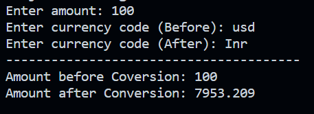

# Real Time Currency Converter

<h3>Task: </h3>
Convert Currency Value using Forex Python Library<br/>

<h3>Note: </h3>
Execute following lines in terminal to install forex-python

``` pip install forex-python ```

<h3>Sample Output: </h3>
